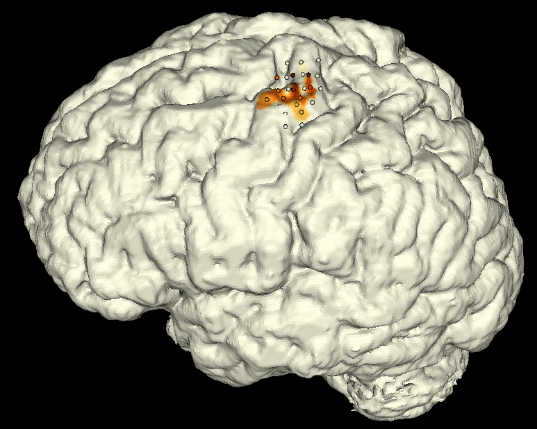

# MEPping - Motor Evoked Potential Mapping

A 3D Slicer Extension that show us a vtk reconstruction of the MEP points into a surface.



## Inputs


- Brain Surface in STL Format
- MEP Points in txt

### MEP

An example of MEP data.

```txt
X	Y	Z	MEP
54.88952772091697	-147.98063979682968	206.38224084678293	10.83
59.497819346893536	-147.80485854682968	209.18215234580637	150.79
63.16229383419822	-147.65936599311874	211.65566308799387	210.63
```
